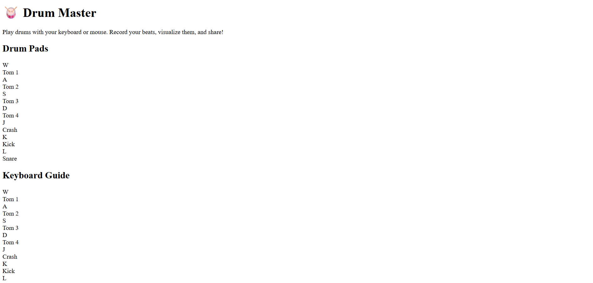

# 🥁 Interactive Drum Kit Web App

A fun, responsive, and dynamic **Drum Kit Web Application** built using **HTML, CSS, and JavaScript**.  
Play drum sounds with **keyboard keys** or by clicking the **on-screen pads**. Features include animations, ripple effects, visualizer, and even recording + playback of your beats.

---

## 🚀 Features
- 🎹 Play sounds via **keyboard (W, A, S, D, J, K, L)** or mouse clicks.
- 🎨 Attractive **UI/UX** with ripple & bounce animations.
- 📱 Fully **responsive** (works on desktop & mobile).
- 🎧 **Live Visualizer** that reacts to beats.
- ⏺ **Recording Studio** → Record, Stop, Play back beats.

---

## 🎮 Demo
👉 [Live Demo on GitHub Pages](https://yourusername.github.io/drum-kit)

---

## 📸 Screenshot


---

## 🛠️ Tech Stack
- **HTML5**
- **CSS3 (Flexbox + Animations)**
- **JavaScript (DOM + Events + Audio API)**

---

## ⚡ Setup & Run Locally
```bash
# Clone the repo
git clone https://github.com/yourusername/drum-kit.git

# Open project folder
cd drum-kit

# Open index.html in your browser
